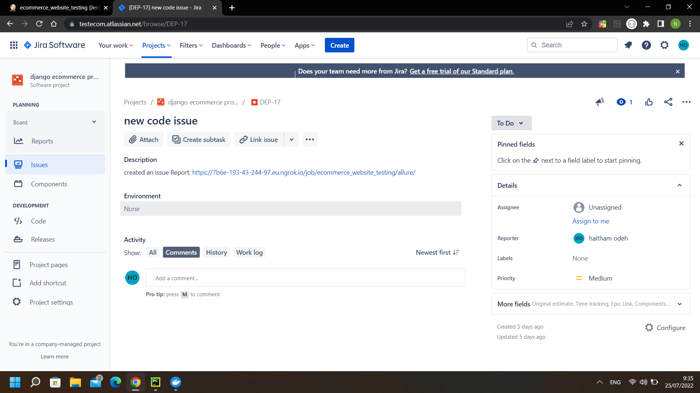

<h1 align=center>E-Commerce Website with Django + React & Redux</h1>
<h2 align=center>Champions Pc - computers hardware Shop</h2>
The final project for BEYOND DEV which I intend in a QA Automation Development Bootcamp,

### How to Run website

```shell
1 Clone This Repo
2 cd backend
3 python -m venv venv
4 .\venv\Scripts\activate
5 pip install -r requirements.txt 
6 python manage.py runserver

```
### How to Run Tests

```shell
1 Clone This Repo
3 python -m venv venv
4 .\venv\Scripts\activate
5 pip install -r requirements.txt 
6 python manage.py runserver
7 download Firefox web driver from [selenium webdrivers](https://www.selenium.dev/documentation/webdriver/getting_started/install_drivers/) and add it to the project folder
8 download selenium grid from [Selenium grid](https://www.selenium.dev/downloads/) and add the file to the project folder
9 java -jar .\selenium-server-4.3.0.jar standalone
10 pytest 

```

### Tests
```
1 Unit tests
2 Integration tests
3 E2E tests (using selenium)
4 STP AND STD attached
```

### Tools
```
1 Selenium
2 Jenkins
3 Docker
4 NGROK
5 Jira
```
### 📷 Project Screenshots




### 🚀 Project Features

A completely customized eCommerce / shopping cart application using Django, REACT and REDUX with the following functionality:

- Full featured shopping cart
- Product reviews and Ratings
- Top products carousel
- Product pagination
- Product search feature
- User profile with orders
- Admin product management
- Admin user management
- Admin Order details page
- Mark orders as a delivered option
- Checkout process (shipping, payment method, etc)
- PayPal / credit card integration
